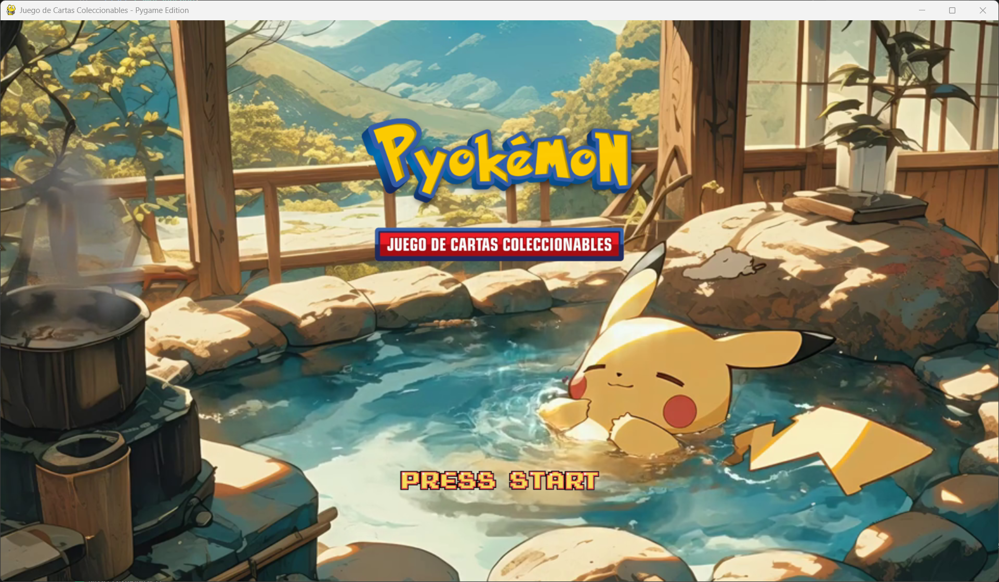
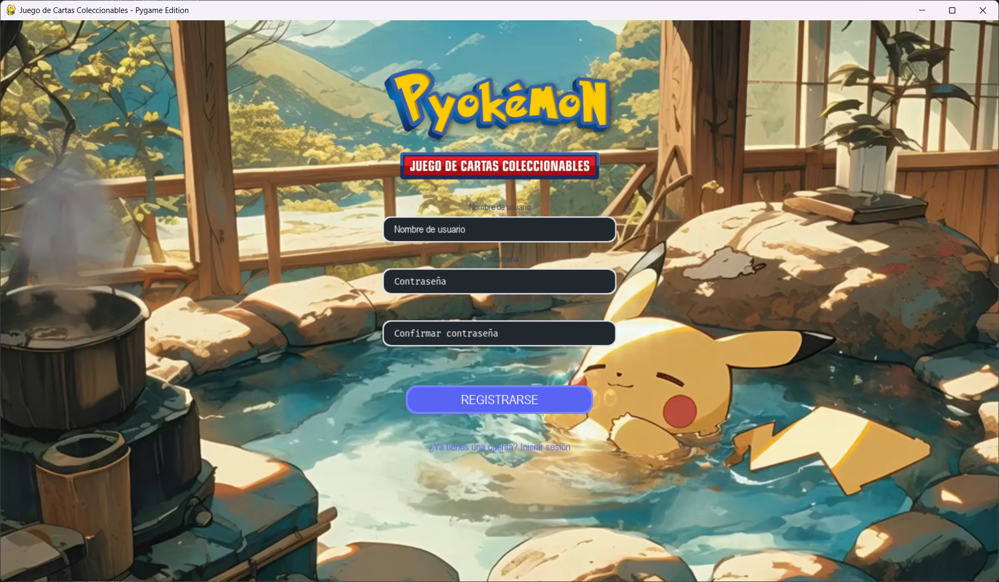
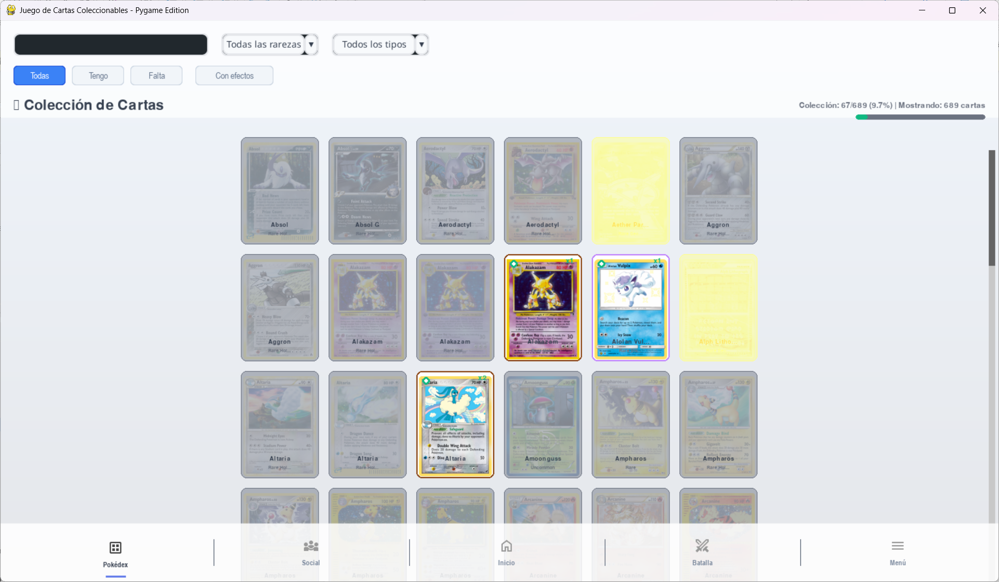
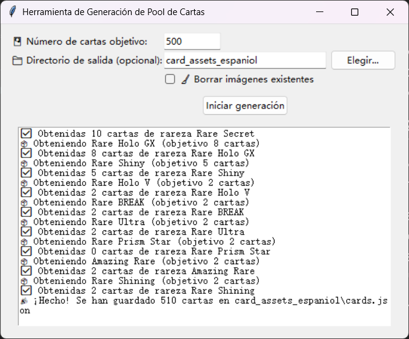

# Pyokemon TCG 项目简介 (Python/PyGame)

（英文版README请见 [README_EN.md](README_EN.md)，西班牙语版请见 [README.md](README.md)。）

## 项目介绍

**Pyokemon TCG** Pyokemon TCG 是一个使用 Python 和 PyGame 开发的宝可梦集换式卡牌游戏模拟器，定位于教育和学习用途。该项目非官方、非商业，旨在通过还原宝可梦卡牌游戏的核心机制来帮助初学者学习游戏开发。Pyokemon TCG 作为一个教学示例，展示了如何构建包含用户登录、GUI界面、回合制逻辑以及API数据获取等功能的完整游戏项目。项目采用模块化架构和良好的编码规范，使其既可玩又方便阅读理解，非常适合用作学习 Python 游戏开发的参考。

## 功能概览

- **用户注册与登录**：提供用户账户系统，新用户可以注册账户，已注册用户可登录。用户资料和游戏进度通过 SQLite 数据库保存在本地。登录过程由 AuthManager管理， 通过token令牌的方式保障数据交互安全，确保不同界面间无需手动传递用户凭据。
- 
- 
- 

- **卡牌图鉴（Pokédex）**：图鉴系统以图形界面展示玩家收集的所有宝可梦卡牌。玩家可以浏览所有卡牌的缩略图，并通过筛选（已拥有/未收集、稀有度、属性等）查看特定卡片。为优化性能，图鉴采用了图像缓存机制，大量卡牌同时显示时仍能保持流畅。
- 

- **界面导航与场景切换**：游戏内置统一的导航栏，可在各主要界面之间平滑切换，包括主页、图鉴、商店、战斗准备等。导航栏通常位于窗口顶端或底部，含图标按钮代表不同模块。Pyokemon TCG 基于模块化场景管理，每个场景对应一个界面逻辑，例如登录场景、主场景、战斗场景等，实现界面解耦和流畅过渡。
- 

- **卡包购买与开启**：模拟宝可梦卡包的购买和开包体验。玩家可在游戏内的**商店**购买卡包（使用虚拟金币等货币），并进入开包界面。开包时有专门的动画效果，玩家点击未打开的卡包，会“撕开”包装并随机展示获得的卡牌。整个过程直观有趣，再现实体卡牌开包的惊喜体验。
- 

- **本地数据存储**：游戏进度均保存在本地设备，例如用户资料、已获得卡牌、构建的卡组、成就统计等都存储于 SQLite 数据库中。此外，卡牌的基础数据也缓存在本地的 JSON 文件中，初次获取后即使离线也可以畅玩。完全本地化的存储确保游戏离线可玩，不依赖持续的网络连接。

- **卡牌爬虫工具**：提供一个独立的**卡牌数据获取工具** `fetch_card_gui`，用于从官方 Pokémon TCG API 抓取卡牌数据并导入游戏。本工具带有简易图形界面，可设定目标卡牌数量、输出目录等，运行后，它将下载卡牌的信息和图片，生成本地的 `cards.json` 数据文件和对应图片资源，为游戏填充最新的卡牌数据（见下文截图）。有了该工具，开发者或教师可以方便地更新游戏卡池数据，用于教学或扩展。
- 

- **卡组构建（开发中）**：正在开发卡组编辑器功能，允许玩家从已收集卡牌中挑选组成自定义卡组并保存，用于战斗对战。卡组编辑界面将提供卡牌过滤、添加/移除卡牌、卡组保存等功能。目前此功能尚在完善阶段。

- **本地战斗系统（开发中）**：项目计划实现单机的 1v1 卡牌对战。当前已完成基础的回合制对战逻辑，正在整合图形界面。战斗系统将利用 `pygame-cards` 库显示双方卡牌，并通过 `pygame-gui` 实现攻击、能量附加等操作的界面。由于采用模块化设计，战斗逻辑和界面分离，未来也易于拓展为联网对战。

- **未来拓展**：得益于良好的架构设计，Pyokemon TCG 可以在未来添加更多功能。例如，扩展商店（加入道具、任务或可解锁物品），在线功能（如多人对战、卡片交易，框架已预留但暂未实现），社交模块（好友列表、聊天等）等。这些功能目前处于规划阶段，没有在当前版本中出现，但代码结构已经为其预留了接口。

## 安装与依赖

**运行环境**：需要安装 Python 3.10 或更高版本。建议在虚拟环境（venv）中安装依赖，以避免影响系统环境。项目主要依赖以下第三方库：

***其中 `pygame-gui` 和`pygame-cards` 存在安装依赖冲突，因此请不要直接使用 `pip install -r requirements.txt` 来配置环境，该`requirement.txt`文件仅作为记录依赖内容使用。***

***如果不清楚如何处理冲突，建议使用 [Windows启动工具](install_env_start_windows.bat) | [Linux启动工具](install_env_start_linux.sh) 来安装环境和启动程序。***

**主要依赖库**：

**pygame** – 用于2D游戏开发的主引擎，负责窗口创建、事件处理和基本绘图。

**pygame-gui** – 基于 PyGame 的 GUI 库，提供界面组件（按钮、文本框、下拉菜单等）和主题样式。Pyokemon TCG 大量使用 pygame-gui 来构建现代化界面。

**pygame-cards** – 第三方卡牌显示库，可方便地绘制卡牌及实现卡牌拖拽、翻转等动画。本项目用于战斗界面的卡牌展示与互动。

**requests** – 用于HTTP请求，与 Pokémon TCG API 通信以获取卡牌数据。

**Pillow (PIL)** – 图像处理库，用于调整卡牌图片大小、格式转换等操作。

**安装依赖**：

[Windows启动工具](install_env_start_windows.bat)
[Linux启动工具](install_env_start_linux.sh)

**辅助开发库**：

- `tkinter` – 构建爬虫 GUI（Python 内置）
- `opencv-python` – 图像处理辅助（开发工具用）
- `graphviz` – 生成目录结构图
- `tqdm` – 控制台进度条

**SQLite**：Python 内置支持，

**开发工具的使用**：

如果您需要更新游戏的卡牌数据或用于教学演示，可以使用附带的卡牌爬虫工具。该工具位于 `development/fetch_card/` 目录下。运行以下命令启动卡牌获取GUI界面：

```bash
python development/fetch_card/fetch_card_gui.py
```

GUI启动后，按照界面提示设置所需参数，例如目标卡牌数量、输出目录等，然后点击开始按钮。工具会联网从官方API抓取卡牌数据并保存到 `card_assets/cards.json` 文件，以及下载卡图到 `card_assets/images/` 目录下。完成后，您就可以重新启动游戏，游戏将加载新的卡牌数据。请注意，该操作需要互联网连接，且应在游戏主程序未运行时执行（更新数据库）。正常情况下，一次导入即可满足后续离线游戏需求，无需每次启动游戏都导入。

对于其他开发相关的脚本（如生成目录树、检测系统字体、卡牌信息检测，图像转化工具等），可根据需要运行相应的 Python 文件。这些工具对于理解项目结构和数据有帮助，但一般玩家无需使用，您可以在有一定的命令行理解的情况下运行这些脚本作为学习或开发辅助。

## 项目结构

本项目按照功能组织目录，区分了游戏逻辑、资源文件和开发者工具等。核心目录结构如下：

- `game/`：游戏核心逻辑，包括认证、数据库、战斗等。

```
game/
├── core/        # 核心逻辑模块（认证 Auth、数据库 Database、对战 Battle 等子模块）
│               # 包含数据访问对象（DAO）类和游戏管理、场景管理等代码
├── scenes/      # 场景定义模块，各子场景对应游戏中的不同界面
│               # （如登录、主页、图鉴、战斗等），实现 UI 布局和交互逻辑
│   ├── login_scene.py     # 登录场景
│   ├── dex_page.py        # 图鉴页面
│   └── battle_page.py     # 战斗页面
├── ui/          # 通用界面组件，封装可重用的 UI 元素供各场景使用
│   ├── navigation_bar/      # 导航栏组件
│   └── battle_interface/    # 卡牌显示组件
├── utils/       # 工具模块，包含辅助函数或类
│   └── video_background.py  # 背景视频处理工具
```

- `assets/`：游戏资源文件目录，包含游戏运行所需的静态媒体资源。

```
assets/
├── images/     # 图片资源（如背景图、卡牌插画等）
├── icons/      # 图标资源（如UI 按钮图标、导航栏图标等）
├── fonts/      # 字体文件（游戏 UI 所用的字体）
├── sounds/     # 音效和音乐文件
├── videos/     # 影片或过场动画文件
├── json/       # JSON 模式的图片数据
```

- `data/`：本地数据目录，用于持久化存储游戏运行过程中产生的数据。

```
data/
├── game_database.db  # SQLite 格式的游戏数据库，保存用户、卡牌、卡组等数据表
├── cards.json        # 卡牌数据文件，由爬虫工具生成
└── cache/            # 缓存处理过的图像资源，如缩放后的卡牌图片，加快加载速度
```

- `development/`：开发者工具目录，非游戏必需，但对开发和维护有用的脚本和资源。

```
development/
├── fetch_card/             # 卡牌获取工具相关文件（如爬虫 GUI 脚本 fetch_card_gui.py）
├── generate_tree.py        # 项目目录树生成脚本，可自动生成当前项目的文件结构图
├── directory_tree.txt      # 项目结构的文本版本（由生成脚本自动更新）
├── directory_tree.png      # 项目结构的图片版本（可视化目录树）
└── ...                     # 其他开发脚本（如数据分析、批量测试等）
```

- 其他文件： 项目根目录下有启动脚本 `main.py`（游戏执行入口），`requirements.txt`（所需Python依赖列表），`README.md`（项目说明文档）等。根据需要还可能包含 `tests/` 测试代码目录等。如果要了解所有文件和目录，可以查看 `development/directory_tree.txt` 获取完整的项目结构信息。

## 运行方法

启动主程序：

```bash
python main.py
```

运行卡牌获取工具：

```bash
python development/fetch_card/fetch_card_gui.py
```

该工具从 Pokémon TCG API 抓取卡牌数据，并保存至 `card_assets/cards.json` 和图片目录。

## 开发背景与许可协议

**开发背景**：Pyokemon TCG 项目由开发者作为教学练习和毕业设计进行构建，开发周期约10周。项目的初衷是在非商业的前提下，探索如何使用 Python 技术栈实现一个小型游戏。它融合了MVC架构思想、模块化编程、接口调用以及SQLite本地存储等知识点，非常适合作为学习范例。开发过程中，作者多次重构了界面和架构以提高性能和可维护性，例如引入 `pygame-gui` 重写界面系统、使用 `pygame-cards` 改进卡牌展示效果，并添加了诸多开发工具提升工作流。该项目既实现了一个可玩的宝可梦卡牌游戏雏形，同时也记录了开发者在过程中学习和运用新技术的历程。对于对游戏开发、Python 编程感兴趣的读者，本项目提供了一个很好的实践参考。

**开源许可说明**：本项目为非商业用途的开源项目，代码以教学和个人娱乐为目的开放。 项目使用的所有宝可梦相关图片、名称等素材版权归任天堂、宝可梦公司及相关版权方所有。本项目对这些素材的使用仅限于模仿和学习，不构成对官方版权的侵犯，也绝不会用于商业盈利。请勿将本项目的任何部分用于商业发行、盈利或其他侵犯官方版权的用途。换言之，Pyokemon TCG 仅供学习交流，禁止商业用途和未经授权的再发布。开发者在遵循开源协议的前提下欢迎其他人学习、借鉴其中的代码。如需引用本项目中的代码或素材，请注明出处并确保用途合法合规。

本项目未附带正式授权协议（License），默认为仅供教育用途。如有需要，可在遵循上述原则前提下自行修改、拓展本项目代码。作者不对本项目提供任何商业支持或保证。游戏中涉及的宝可梦形象和卡牌数据仅作为练习素材使用，其商标及著作权归原权利方所有，在此特此声明。
