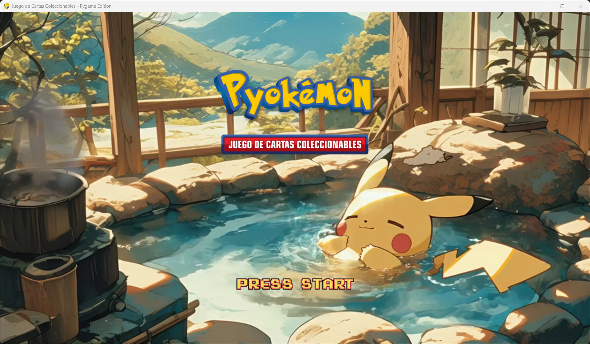
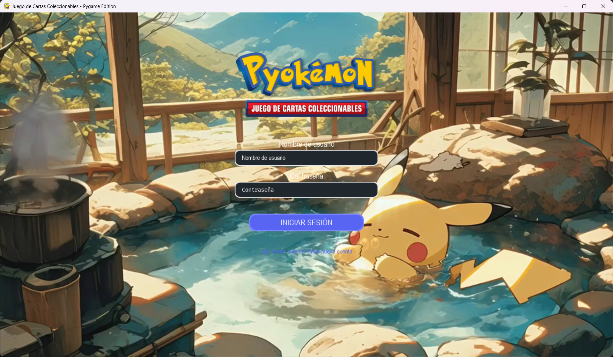
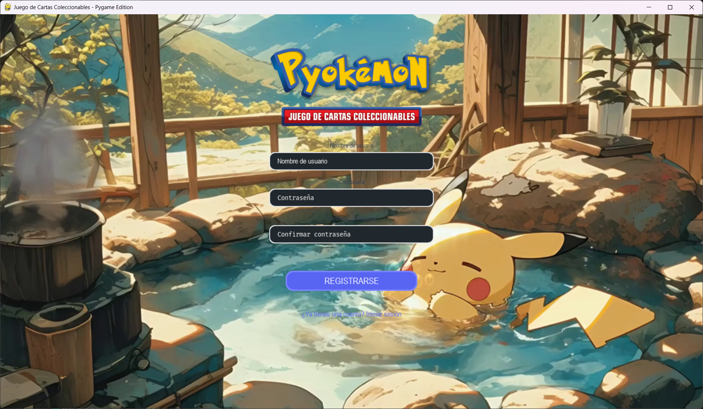
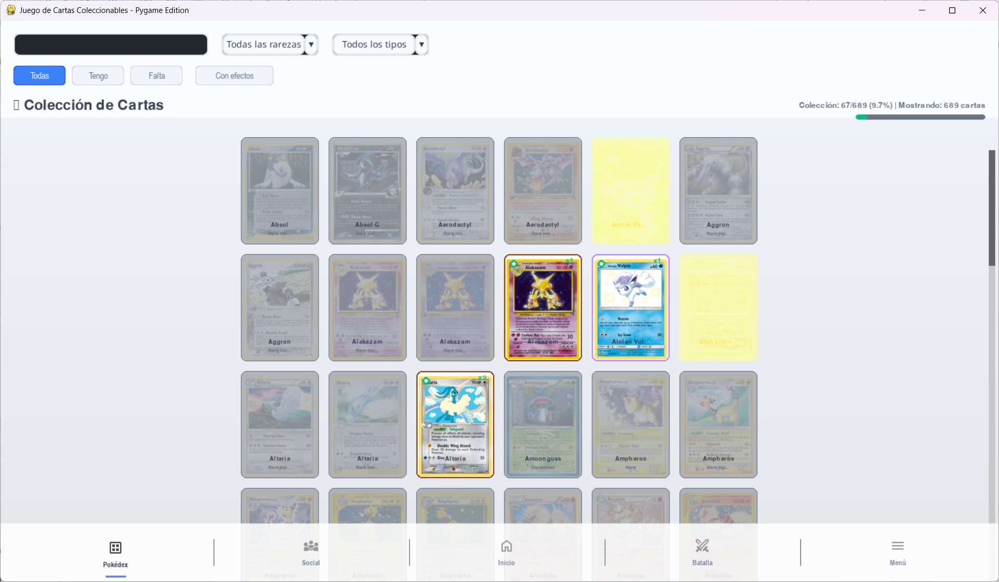
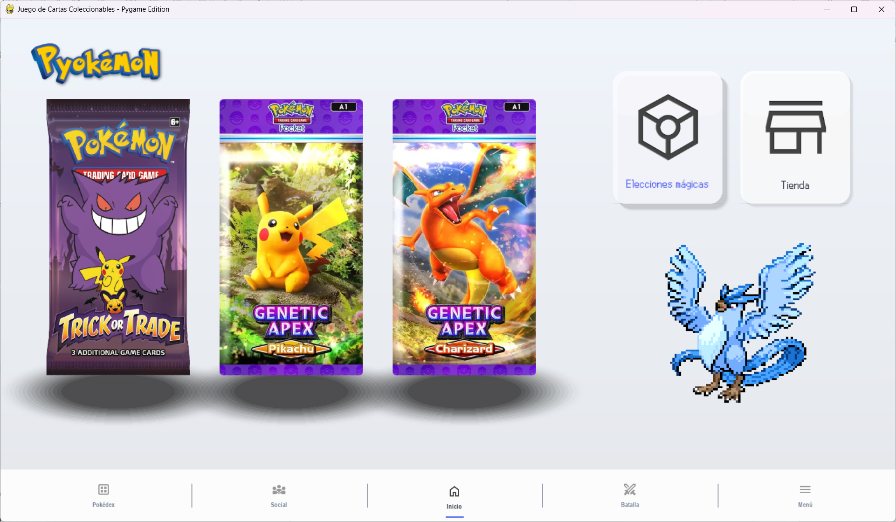
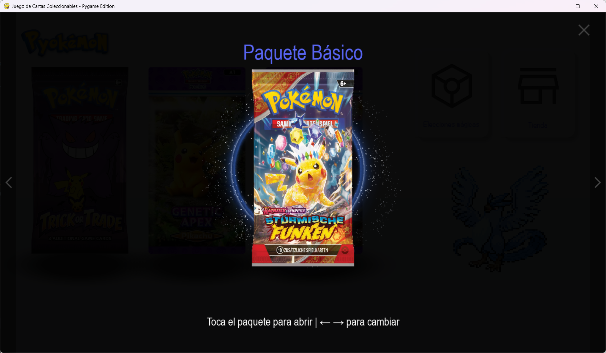
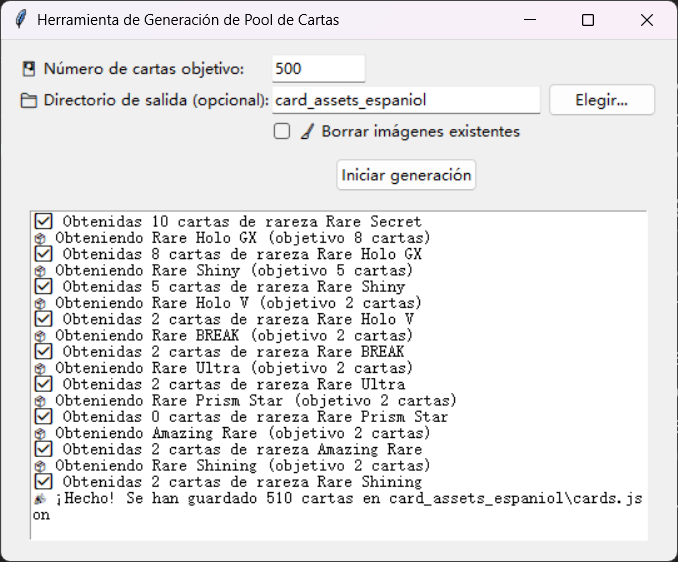

# Pyokemon TCG Project Overview (Python/PyGame)

(For the Chinese version, see [README_CN.md](README_CN.md). For the Spanish version, see [README_ES.md](README.md).)

## Project Introduction

**Pyokemon TCG** is a fan-made Pokémon Trading Card Game simulator developed using Python and PyGame, intended for educational and learning purposes. This is a non-official, non-commercial project aimed at helping beginners learn game development by replicating the core mechanics of the Pokémon TCG. Pyokemon TCG serves as a comprehensive teaching example, demonstrating how to build a complete game project including user login, GUI interfaces, turn-based logic, and API data retrieval. It adopts a modular architecture and clean coding practices, making it both playable and easy to understand — ideal for anyone learning Python game development.

## Feature Overview

- **User Registration and Login**: A user account system allows new users to register and existing users to log in. User profiles and game progress are saved locally using an SQLite database. The login process is managed by `AuthManager`, which uses token-based authentication to ensure secure data exchange without manually passing user credentials between scenes.
- 
- 
- 

- **Card Pokédex**: A visual interface that displays all collected Pokémon cards. Players can browse card thumbnails and filter by ownership, rarity, type, and more. For performance optimization, image caching is implemented to ensure smooth rendering even with many cards displayed simultaneously.
- 

- **Interface Navigation and Scene Switching**: The game features a unified navigation bar allowing smooth transitions between major scenes like Home, Pokédex, Shop, and Battle Preparation. Typically located at the top or bottom of the window, the bar includes icon buttons for different modules. Each scene, such as login, main, or battle, is implemented as a self-contained module, ensuring decoupling and a fluid user experience.
- 

- **Pack Purchasing and Opening**: Simulates the experience of buying and opening Pokémon card packs. Players can purchase packs in the in-game **Shop** using virtual currency, then open them with animated effects. Clicking an unopened pack “tears” the wrapper and displays randomly obtained cards. This intuitive and engaging process mimics the thrill of real-world card opening.
- 

- **Local Data Storage**: Game progress is stored locally, including user profiles, obtained cards, decks, and achievement stats, using SQLite. Card data is also cached in local JSON files, allowing the game to be played offline after the first setup. Fully localized storage ensures no persistent internet connection is needed.

- **Card Crawler Tool**: A standalone card data fetching tool `fetch_card_gui` allows importing cards from the official Pokémon TCG API. With a simple GUI, users can set the number of cards to fetch and output location. The tool downloads card metadata and images, generating a local `cards.json` and image resources for the game. This allows educators and developers to easily update the game’s card pool.
- 

- **Deck Building (In Development)**: A deck editor is under development, enabling players to build and save custom decks using collected cards. Features will include card filtering, add/remove operations, and saving multiple deck profiles. This module is currently in progress.

- **Local Battle System (In Development)**: Plans include implementing a local 1v1 battle mode. Basic turn-based logic is completed and integration with GUI is ongoing. Using `pygame-cards` for visual card interactions and `pygame-gui` for actions like attacking or attaching energy, the modular design separates logic from UI for future online support.

- **Future Expansion**: Thanks to its modular design, Pyokemon TCG is ready for future features like shop expansion (items, quests, unlockables), online modes (PvP, trading – already stubbed), and social features (friends list, chat). These are not yet implemented, but architectural hooks are in place.

## Installation & Dependencies

**Environment**: Requires Python 3.10 or later. It is recommended to use a virtual environment to avoid interfering with system-wide packages. The project depends on the following third-party libraries:

***Due to dependency conflicts between `pygame-gui` and `pygame-cards`, do NOT install using `pip install -r requirements.txt`. This file is for reference only.***

***If unsure how to resolve conflicts, use the [Windows Startup Tool](install_env_start_windows.bat) or [Linux Startup Tool](install_env_start_linux.sh) for setup and launching.***

**Key Dependencies**:

- **pygame** – Core 2D game engine for window handling, event processing, and basic rendering.
- **pygame-gui** – GUI framework built on PyGame, used for interface components like buttons, input boxes, dropdowns.
- **pygame-cards** – A third-party library for card display and interactions such as dragging and flipping; used in battle interface.
- **requests** – For HTTP communication with the Pokémon TCG API.
- **Pillow (PIL)** – Image processing library for resizing and format conversion.

**Install Environment**:

- [Windows Startup Tool](install_env_start_windows.bat)
- [Linux Startup Tool](install_env_start_linux.sh)

**Additional Dev Libraries**:

- `tkinter` – For the fetcher GUI (built-in)
- `opencv-python` – Image processing (for dev tools)
- `graphviz` – Generates directory trees
- `tqdm` – Console progress bars

**SQLite**: Built-in with Python.

**Using Developer Tools**:

To update card data or for teaching purposes, use the card crawler in `development/fetch_card/`. Launch the GUI with:

```bash
python development/fetch_card/fetch_card_gui.py
```

Set parameters like target card count and output folder, then click start. The tool fetches card data from the API and saves it to `card_assets/cards.json` and card images to `card_assets/images/`. Ensure the game is not running during this update. Typically, one import is sufficient for offline play.

Other dev scripts (directory tree generator, system font checks, card image tools) can be run manually for development insight. Players do not need these for normal gameplay.

## Project Structure

The project is organized by functionality, separating game logic, assets, and dev tools. Core structure:

- `game/`: Main logic including auth, database, battles.

```
game/
├── core/        # Core modules (Auth, DB, Battle, etc.)
├── scenes/      # Scene definitions (Login, Home, Pokédex, Battle)
│   ├── login_scene.py
│   ├── dex_page.py
│   └── battle_page.py
├── ui/          # Reusable UI components
│   ├── navigation_bar/
│   └── battle_interface/
├── utils/
│   └── video_background.py
```
- `assets/`: Media resources for the game.

```
assets/
├── images/     # Backgrounds, card art, etc.
├── icons/      # UI icons
├── fonts/      # Font files
├── sounds/     # SFX and music
├── videos/     # Cutscenes
├── json/       # Image data
```

- `data/`: Local data including user saves.

```
data/
├── game_database.db  # SQLite database
├── cards.json        # Card data (from fetcher)
└── cache/            # Cached scaled images
```

- `development/`: Dev tools, optional for players.

```
development/
├── fetch_card/             # Card fetching tool
├── generate_tree.py        # Directory tree generator
├── directory_tree.txt      # Text version of structure
├── directory_tree.png      # Visual version
└── ...                     # Other dev tools
```

- Root Files: Includes `main.py` (entry point), `requirements.txt`, `README.md`, etc. For full file structure, see `development/directory_tree.txt`.

## How to Run

To start the main program:

```
python main.py
```

To run the card fetcher:

```
python development/fetch_card/fetch_card_gui.py
```

This tool fetches from the Pokémon TCG API and stores data in card_assets/cards.json and image folder.

## Development Background & License

**Development Background**: Pyokemon TCG was created as a teaching exercise and graduation project over roughly 10 weeks. The goal was to explore building a small game using Python in a non-commercial context. It incorporates MVC architecture, modular code, API usage, and SQLite storage — ideal as a learning reference. During development, the interface and structure were refactored several times for performance and maintainability, including switching to `pygame-gui`, integrating `pygame-cards`, and adding various dev tools. The result is a playable TCG prototype and a chronicle of the developer’s learning journey. It’s a great example for anyone interested in Python and game development.

**License Disclaimer**: This is an open-source, non-commercial project intended for educational and personal entertainment purposes only. All Pokémon-related images, names, and materials belong to Nintendo, The Pokémon Company, and respective rights holders. This project imitates these materials strictly for learning and does not constitute infringement or commercial use. Do not use any part of this project for commercial purposes or unauthorized redistribution. In short, Pyokemon TCG is for learning only — commercial use is prohibited. The author welcomes others to study and reference the code, but please credit the source and ensure lawful usage.

This project does not include a formal license and is considered educational-use only. You may modify or extend the code following the above principles. The author provides no commercial support or warranties. Pokémon images and data are used for practice purposes only; all rights remain with their original owners.